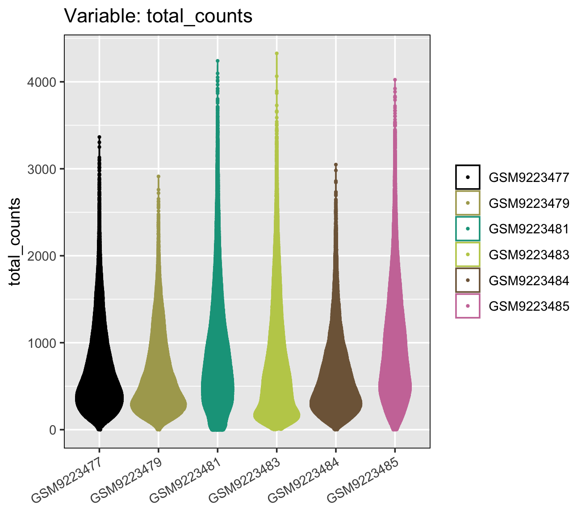
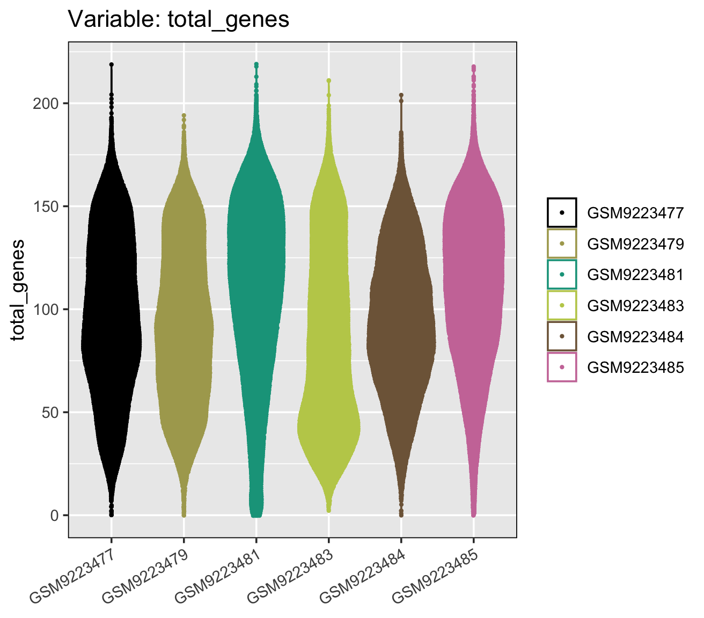

# **Data Exploration**
***

Add instructions for loading the data...

***
<details> <summary> If you skipped the data import section click here. </summary>

Add instructions for loading the data...

</details>
***

```{r, eval = FALSE}
summarize_STlist(scz_spatial)
```

This is a 6 X 9 dataframe that provides

  1. `sample_name`: GEO IDs we provided in sample metadata
  2. `spotscells`: how many spots or cells that sample has
  3. `genes`: how many genes that sample has
  4. `min_counts_per_spotcell`: minimum number of counts per spot or cell for that sample
  5. `mean_counts_per_spotcell`: average number of counts per spot or cell for that sample
  6. `max_counts_per_spotcell`: maximum number of counts per spot or cell for that sample
  7. `min_genes_per_spotcell`: minimum number of genes (with non-zero counts?) per spot or cell for that sample
  8. `mean_genes_per_spotcell`: average number of genes (with non-zero counts?) per spot or cell for that sample
  9. `max_genes_per_spotcell`: maximum number of genes (with non-zero counts?) per spot or cell for that sample

|sample_name|spotscells|genes|min_counts|mean_counts|max_counts|min_genes|mean_genes|max_genes|
|:--------:|:--------:|:----:|:-------:|:-----------:|:------:|:--------:|:--------:|:-------:|
| GSM9223477 | 48542 |  541 | 0 | 680. | 3365 | 0 | 97.5 | 219 |
| GSM9223479 | 45675 |  541 | 0 | 615. | 2912 | 0 | 92.4 | 194 |
| GSM9223481 | 61932 |  541 | 0 | 860. | 4241 | 0 | 108. | 219 |
| GSM9223483 | 59962 |  541 | 2 | 750. | 4327 | 2 | 86.0 | 211 |
| GSM9223484 | 44655 |  541 | 0 | 619. | 3048 | 0 | 94.3 | 204 |
| GSM9223485 | 68976 |  541 | 0 | 939. | 4024 | 0 | 110. | 218 |

Violin plot of counts per spot/cell for each sample

```{r, eval = FALSE}
distribution_plots(scz_spatial, plot_type='violin', plot_meta='total_counts')
```

{fig-alt="six violins showing how many counts each spot or cell has for each sample" width=800 .lightbox}

Violin plot of genes per spot/cell for each sample

```{r, eval = FALSE}
distribution_plots(scz_spatial, plot_type='violin', plot_meta='total_genes')
```

{fig-alt="six violins showing how many genes each spot or cell has for each sample" width=800 .lightbox}

What do we observe:

* There aren't any samples that have a huge number of counts or genes higher than other samples, so I don't think we'll need to use a spot_max* argument within the `filter_data` function
* Every sample has at least 0 or 2 counts as a minimum (I'm surprised that it reports 0 and not the lowest non-zero value)
* Every sample has at least 0 or 2 genes as a minimum as well.
* Mean counts is around 600-900, with maxes in the thousands.
* Going to set a minimum of 500 reads/counts for each spot/cell since that's a little below the mean.
* Mean genes is around 80-110, with maxes around 200.
* Going to set a minimum of 50 genes for each spot/cell since that's a little below the mean.
* Some samples have a lot more spots/cells than others .... I should probably make a table after filtering to see if there are a similar number of spots/cells after filtering. But I also figure that means the tissue is different sizes?

::: {.column-margin}
**Given this table and these violin plots, are there filtering parameters you would suggest besides the ones I mentioned?**
:::

Won't need to save data at the end of this step because we haven't changed anything.
