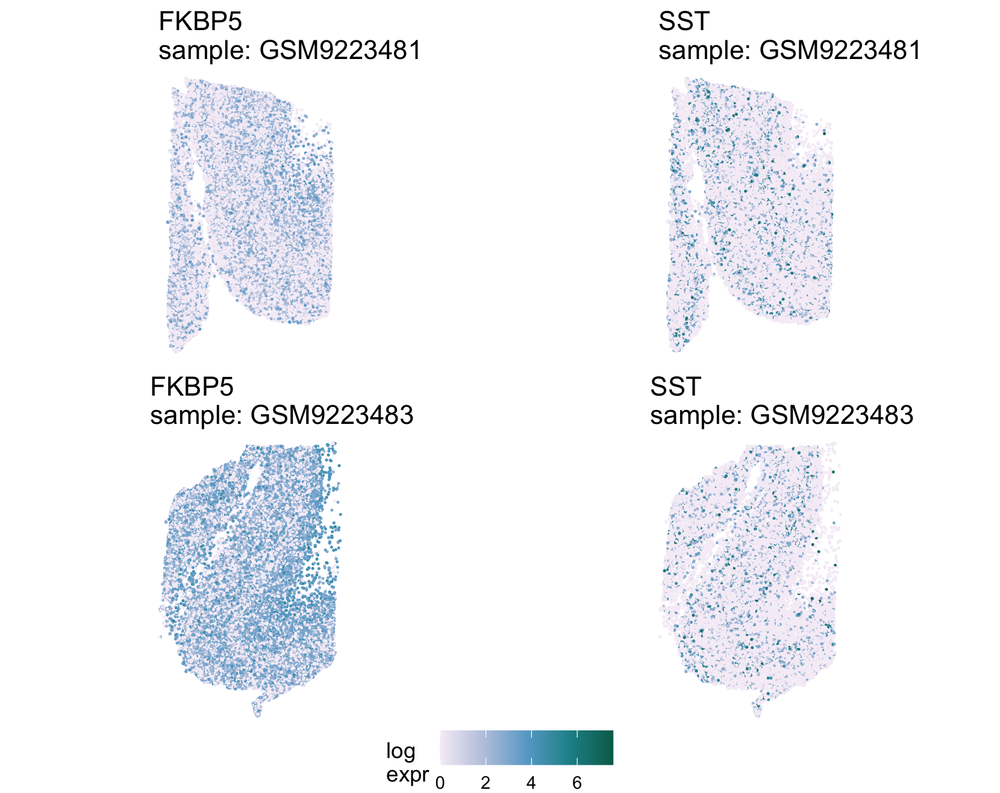
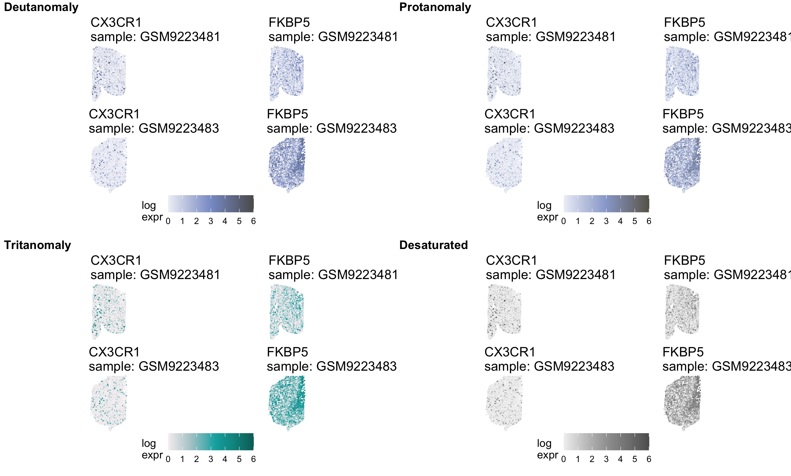

# **Data Visualization**
***


If you have been following along but stopped, we could load our imported data like so:

Add instructions for loading the data...

***
<details> <summary> If you skipped the data import section click here. </summary>

Add instructions for loading the data...

</details>
***

The genes I'm considering for this are SST, FKBP5, and CX3CR1. More discussion about these below, but suffice it to say that I at first grabbed two that were labeled in the Figure 2a volcano plot.

We're going to make quilt plots showing the expression of these genes for each spot/cell in two samples (one NTC and one SCZ).

Note that quilt plots don't require histology image (image of the tissue), because the spatial coordinates data that we input provides x and y coordinates for the center of each cell/spot. Therefore, we can place the location of these cells without a tissue image.

Also note that this is Xenium data which means there are a lot of cells! So we're going to use the `ptsize` argument to set the point size of the spots or cells to be really small. If we make it too large, it's dense/cramped/hard to view the quilt plot

I tested several color palettes and settled on `PuBuGn`.... more explanation below.

We have `ggpubr` combine the common legends and display them on the bottom. It also is plotting the quilt plots in a 2 X 2 grid

::: {.panel-tabset}

## CX3CR1

```{r, eval = FALSE}
quilt25 <- STplot(scz_spatial,
                  samples = samples_metadata$X1[c(2,5)],
                  genes = c("CX3CR1", "FKBP5"),
                  color_pal='PuBuGn',
                  ptsize=0.05)

ggpubr::ggarrange(plotlist=quilt25,
                  nrow=2,
                  ncol=2,
                  legend='bottom',
                  common.legend = TRUE)
```

{fig-alt="Quilt plot showing the expression of two genes for a control neurotypical sample on the top and a Schizophrenia diagnosis sample on the bottom. Points in each quilt plot represent a single cell or spot within its spatial context. Expression levels are displayed with a color gradient where light purple corresponds to low expression, blue corresponds to medium expression, and green corresponds to high expression. The first gene on the left is CX3CR1 a downregulated gene and we see lower expression levels on the bottom quilt plot because it is paler overall. The gene on the right is FKBP5 an upregulated gene and we see higher levels of expression on the bottom quilt plot because it has more blues and greens." width=800 .lightbox}

## SST

```{r, eval = FALSE}
quilt25 <- STplot(scz_spatial,
                  samples = samples_metadata$X1[c(2,5)],
                  genes = c("SST", "FKBP5"),
                  color_pal='PuBuGn',
                  ptsize=0.05)

ggpubr::ggarrange(plotlist=quilt25,
                  nrow=2,
                  ncol=2,
                  legend='bottom',
                  common.legend = TRUE)
```

{fig-alt="Quilt plot showing the expression of two genes for a control neurotypical sample on the top and a Schizophrenia diagnosis sample on the bottom. Points in each quilt plot represent a single cell or spot within its spatial context. Expression levels are displayed with a color gradient where light purple corresponds to low expression, blue corresponds to medium expression, and green corresponds to high expression. The first gene on the left is FKBP5 an upregulated gene and we see higher levels of expression on the bottom quilt plot because it has more blues and greens. The gene on the right is SST a downregulated gene and we see lower expression levels on the bottom quilt plot because it is paler overall." width=800 .lightbox}

:::

::: {.column-margin}
**Which downregulated gene (SST or CX3CR1) would you recommend visualizing in this section?**
:::

**Which downregulated gene?**

The genes SST and FKBP5 are both annotated in the Figure 2a Volcano Plot as DEGs. SST is downregulated in SCZ cases and FKBP5 is upregulated in SCZ cases.

Looking at the quilt plot for SST however, it wasn't as clearly downregulated as I was hoping. So I went to [Supplementary Table 4 from the paper](https://www.biorxiv.org/content/biorxiv/early/2026/02/17/2026.02.16.706214/DC5/embed/media-5.xlsx?download=true) and found the gene with the lowest / most negative log fold change: CX3CR1

**Between SST and CX3CR1, which one would be the better plot to include? Considerations...**

  * I personally think that it's easier to observe that CX3CR1 appears downregulated in the quilt plots
  * I like that SST is annotated in Figure 2 and that's why we grabbed it (CX3CR1 isn't).

**Color Palettes**

I tested several color palettes and settled on `PuBuGn` for several reasons. (Note: this could be a cool side quest to include in the case study)

1. Easier to distinguish changes in expression (e.g., up vs down regulated). `BuRd` and `Spectral` were best for this otherwise.
2. The lighter color was no longer in the center (as if the log expression values were "centered") and instead is on the lower level of the spectrum. `Spectral` was the only other one not centered on white, but it was still centered on a lighter color.
3. Looking at the result with a color vision deficiency simulator (`cvg_grid()` from `colorblindr`) the general conclusions are still possible in my opinion. This wasn't the case with `PrGn`, `BuRd`, or `Spectral` when I tested them.



Note that this simulator example is only for the CX3CR1 gene, but it was true for the SST gene too.

***
