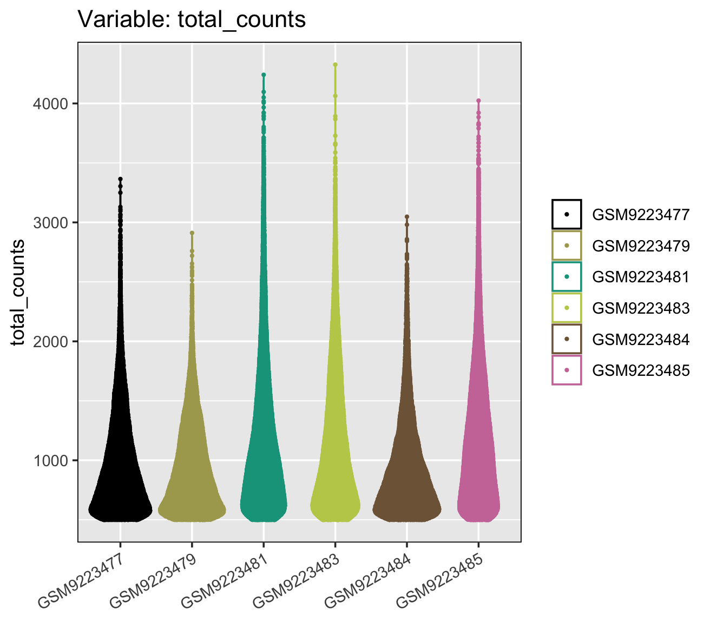
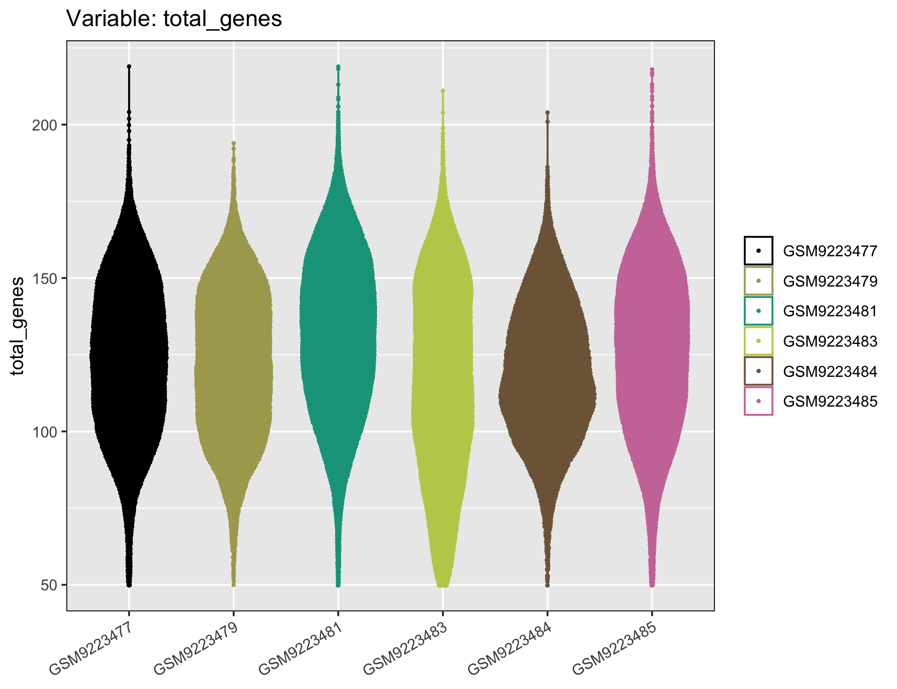

<!--
Update the file paths as needed throughout
-->

<!--
Some case studies may wish to merge Data Exploration with this Wrangling subsection
-->

<!--
At the end of this section, save incremental data so that users can pause and come back later
-->

# **Data Wrangling**
***

If you have been following along but stopped, we could load our imported data like so:

Add instructions for loading the data...

***
<details> <summary> If you skipped the data import section click here. </summary>

Add instructions for loading the data...

</details>
***

## Filtering

Note that values used for filtering here are based on results in the data exploration section above. So it and the data exploration section should either be combined in the final case study draft, or we'll add a note about people needing to visit the data exploration step to under the values we're using.

```{r, eval = FALSE}
scz_spatial <- filter_data(scz_spatial,
                           spot_minreads=500,
                           spot_mingenes=50)
```

I haven't tried a lot of other values here, but based on the summarize table the violin plots, I'm happy to try other values you might suggest. Will definitely discuss the topic of choosing filter values here and what that impacts/what should motivate those choices/in a real analysis, you're probably trying the analysis with a few to see how robust findings are

I did try a lower number for minimum genes (25), but the quilt plots were much more cramped.

<details><summary>What do the Violin plots look like now?</summary>

::: {.panel-tabset}

### Table

```{r, eval = FALSE}
summarize_STlist(scz_spatial)
```

|sample_name|spotscells|genes|min_counts|mean_counts|max_counts|min_genes|mean_genes|max_genes|
|:--------:|:--------:|:----:|:-------:|:-----------:|:------:|:--------:|:--------:|:-------:|
| GSM9223477 | 27106 |  541 | 500 | 974. | 3365 | 50 | 124. | 219 |
| GSM9223479 | 22869 |  541 | 500 | 935. | 2912 | 50 | 122. | 194 |
| GSM9223481 | 41494 |  541 | 500 | 1149.| 4241 | 50 | 132. | 219 |
| GSM9223483 | 33036 |  541 | 500 | 1148.| 4327 | 50 | 116. | 211 |
| GSM9223484 | 22845 |  541 | 500 | 930. | 3048 | 50 | 119. | 204 |
| GSM9223485 | 50588 |  541 | 500 | 1167.| 4024 | 50 | 126. | 218 |

### Total Counts

```{r, eval = FALSE}
distribution_plots(scz_spatial, plot_type='violin', plot_meta='total_counts')
```

{fig-alt="six violins showing how many counts each spot or cell has for each sample following filtering" width=800 .lightbox}

### Total Genes

```{r, eval = FALSE}
distribution_plots(scz_spatial, plot_type='violin', plot_meta='total_genes')
```

{fig-alt="six violins showing how many genes each spot or cell has for each sample following filtering" width=800 .lightbox}

:::

</details>

## Normalizing

We're using a log transform. Another option is the SCTransform which we'll explain in a click to expand section. We can even compare the two normalization methods (but I'll have to make two separate `STlist`'s for that)

```{r, eval = FALSE}
scz_spatial <- transform_data(scz_spatial, method='log', cores=2)
```
***

::: {.column-margin}
**Should I add a visualization of what the normalized data looks like?**
:::

How would we go about adding a visualization of what normalized data looks like if we do?

  * Note that the `pseudobulk_heatmap()` looks like a good candidate function for this from `spatialGE`
  * However, we would first have to run `pseudobulk_samples()` ... which we'd need to do before the suggested HW of the `pseudoblock_dim_plot()` anyways.
  * So I think this is either a candidate for a side quest (in a click to expand section here), or something that we'll put in the suggested homework solely.

Add instructions on saving the dataset here.
