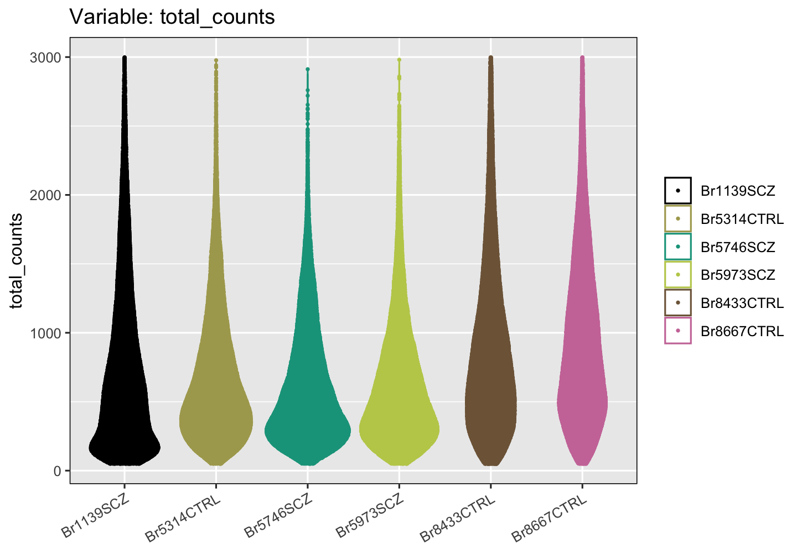
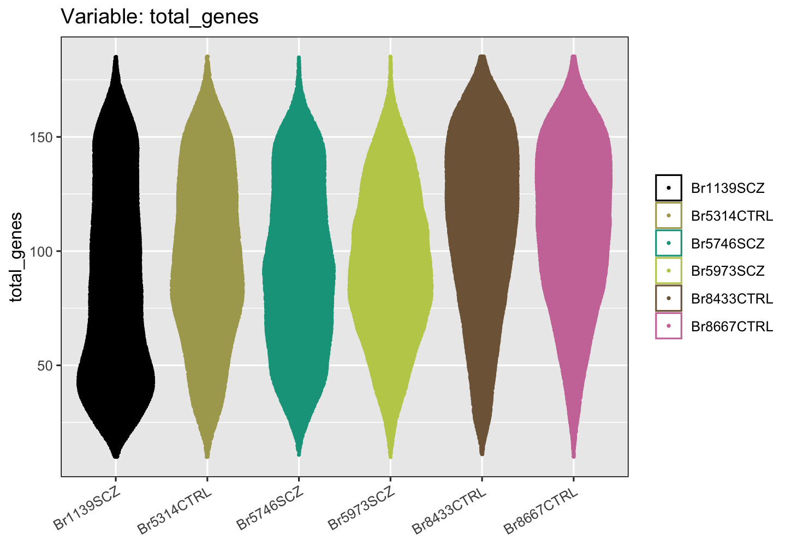
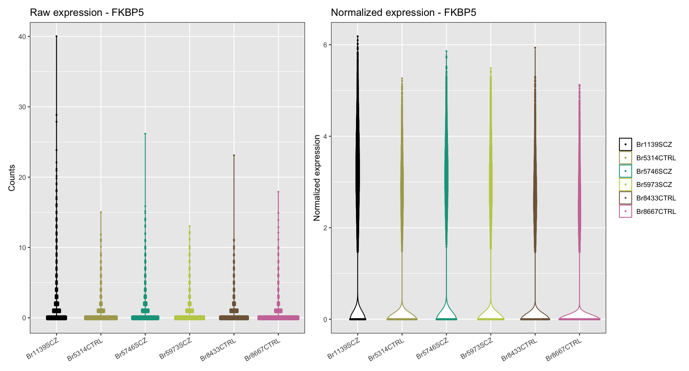
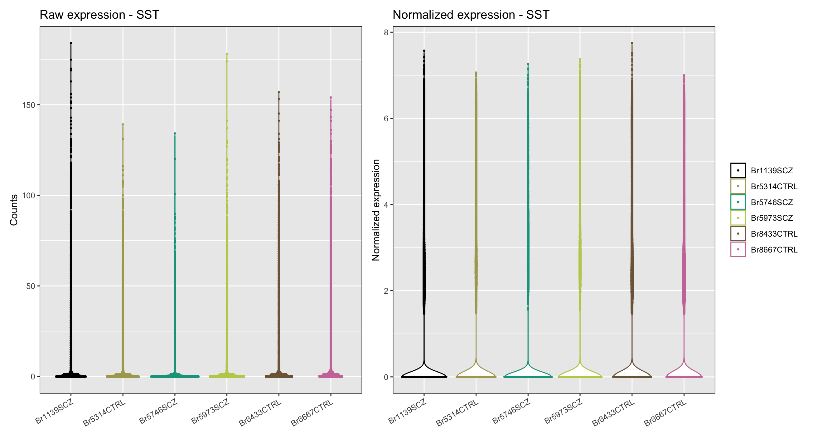

<!--
Update the file paths as needed throughout
-->

<!--
Some case studies may wish to merge Data Exploration with this Wrangling subsection
-->

<!--
At the end of this section, save incremental data so that users can pause and come back later
-->

# **Data Wrangling**
***

If you have been following along but stopped, we could load our imported data like so:

Add instructions for loading the data...

***
<details> <summary> If you skipped the data import section click here. </summary>

Add instructions for loading the data...

</details>
***

## Filtering

Note that values used for filtering here are based on results in the data exploration section above. So it and the data exploration section should either be combined in the final case study draft, or we'll add a note about people needing to visit the data exploration step to under the values we're using.

```{r, eval = FALSE}
scz_spatial <- filter_data(scz_spatial,
                           spot_minreads=50,
                           spot_maxreads=3000,
                           spot_mingenes=10,
                           spot_maxgenes = 185)
```


<details><summary>What do the Violin plots look like now?</summary>

::: {.panel-tabset}

### Table

```{r, eval = FALSE}
summarize_STlist(scz_spatial)
```

# A tibble: 6 × 9
  sample_name spotscells genes min_counts_per_spotcell mean_counts_per_spotcell max_counts_per_spotcell min_genes_per_spotcell mean_genes_per_spotc…¹ max_genes_per_spotcell
  <chr>            <int> <int>                   <dbl>                    <dbl>                   <dbl>                  <int>                  <dbl>                  <int>
1 Br1139SCZ        59438   541                      50                     749.                    2998                     10                   86.2                    185
2 Br5314CTRL       48410   541                      50                     680.                    2977                     10                   97.6                    185
3 Br5746SCZ        45531   541                      50                     617.                    2912                     11                   92.6                    185
4 Br5973SCZ        44479   541                      50                     621.                    2981                     10                   94.6                    185
5 Br8433CTRL       59234   541                      50                     872.                    2998                     11                  111.                     185
6 Br8667CTRL       68202   541                      50                     937.                    2998                     10                  111.                     185

### Total Counts

```{r, eval = FALSE}
distribution_plots(scz_spatial, plot_type='violin', plot_meta='total_counts')
```

{fig-alt="six violins showing how many counts each spot or cell has for each sample following filtering" width=800 .lightbox}

### Total Genes

```{r, eval = FALSE}
distribution_plots(scz_spatial, plot_type='violin', plot_meta='total_genes')
```

{fig-alt="six violins showing how many genes each spot or cell has for each sample following filtering" width=800 .lightbox}

:::

</details>

## Normalizing

We're using a log transform. Another option is the SCTransform which we'll explain in a click to expand section. We can even compare the two normalization methods (but I'll have to make two separate `STlist`'s for that)

```{r, eval = FALSE}
scz_spatial <- transform_data(scz_spatial, method='log', cores=2)
```

We can visualize the distribution of expression of a couple of genes (before and after the normalization) using the `distribution_plots()` function.

```{r, eval = FALSE}
raw_plots <- distribution_plots(scz_spatial, genes = c("CX3CR1", "FKBP5", "SST"), data_type = "raw")

transformed_plots <- distribution_plots(scz_spatial, genes = c("CX3CR1", "FKBP5", "SST"), data_type = "tr)

raw_plots$CX3CR1 + transformed_plots$CX3CR1 + patchwork::plot_layout(guides = "collect")
```
{fig-alt="Two panels with six violin plots each showing the distribution of the CX3CR1 gene prior to normalization and after normalization for each sample."}

```{r, eval = FALSE}
raw_plots$FKBP5 + transformed_plots$FKBP5 + plot_layout(guides="collect")
```

{fig-alt="Two panels with six violin plots each showing the distribution of the FKBP5 gene prior to normalization and after normalization for each sample."}

```{r, eval = FALSE}
raw_plots$SST + transformed_plots$SST + plot_layout(guides = "collect")
```

{fig-alt="Two panels with six violin plots each showing the distribution of the SST gene prior to normalization and after normalization for each sample."}

```{r, eval = FALSE}
saveRDS(scz_spatial, here("data/wrangled/scz_spatial.rds"))
```

***