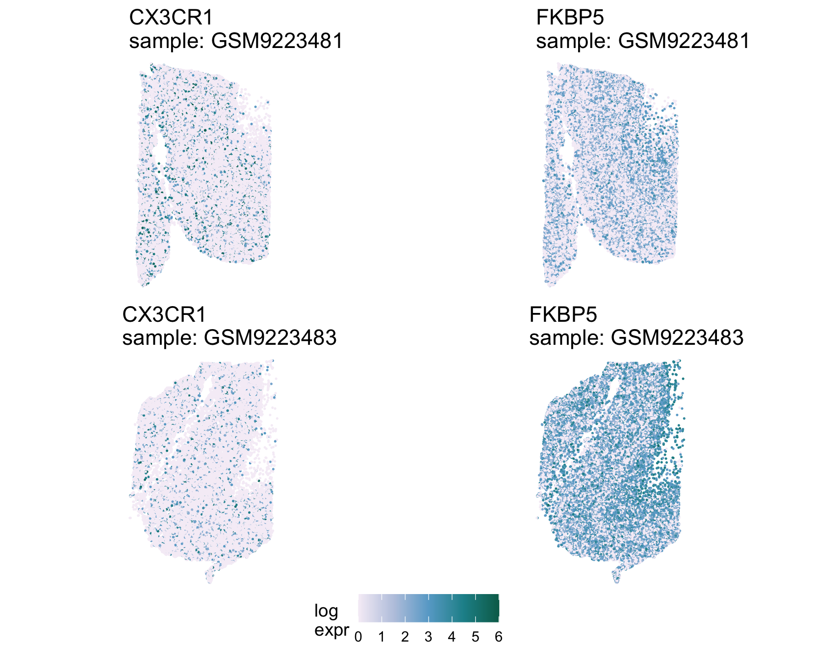

#### {.outline }

<!--
Replace the `img/mainplot.png` image with the appropriate case study image or consider using ottrpal::include_slide() with a publicly viewable slide deck as needed.
See image here for example: https://www.opencasestudies.org/ocs-bp-school-shootings-dashboard/
-->

{fig-alt="Quilt plot showing the expression of two genes for a control neurotypical sample on the top and a Schizophrenia diagnosis sample on the bottom. Points in each quilt plot represent a single cell or spot within its spatial context. Expression levels are displayed with a color gradient where light purple corresponds to low expression, blue corresponds to medium expression, and green corresponds to high expression. The first gene on the left is CX3CR1 a downregulated gene and we see lower expression levels on the bottom quilt plot because it is paler overall. The gene on the right is FKBP5 an upregulated gene and we see higher levels of expression on the bottom quilt plot because it has more blues and greens." width=800 .lightbox}

####
