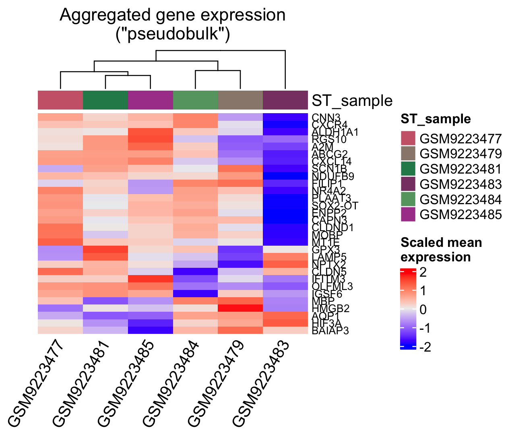
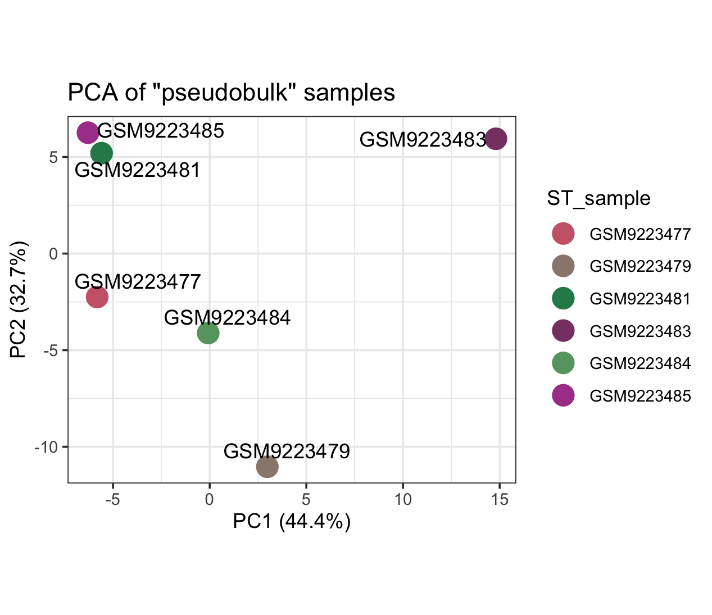

# **Continued Learning**
***

:::{.next_steps_box}
::::{.next_steps_box_header}
Common Next Steps
::::
::::{.inner_block}
Discuss common next steps for this type of an analysis in this box. Is there a specific number of steps that you need to do before a specific step? Is a "next step" more of an alternate step?
::::
:::

For the suggested homework, I think it would make sense to do a PCA of the samples, which is something Brooke had suggested. We can do this locally like all the steps except for the autocorrelation analysis.

```{r, eval = FALSE}
scz_spatial <- pseudobulk_samples(scz_spatial, max_var_genes = 150) #decreased compared to the default since the Xenium panel is based on a lower number of genes than say Visium data
pseudobulk_heatmap(scz_spatial)
```


```{r, eval = FALSE}
pseudobulk_dim_plot(scz_spatial)
```



When I try to color the PCA plot by a variable in my sample metadata (using `plot_meta` parameter), it errors and tells me that data doesn't exist. I've tried changing capitalization and several other steps, but the value should be there.

::: {.column-margin}
**Do you know what I could be doing wrong here using the `plot_meta` argument?**
:::

Column names:
```
X1         `Brain Number (ID)` Sex   PrimaryDx
```

Error:
```
Error in prepare_pseudobulk_meta(x, plot_meta) :
Variable not in sample metadata. Verify that input matches variable name in sample data
```

<!--
## Reinforcement Exercises

Uncomment this section if you're suggesting an exercise that reiterates a large portion of the case study so learners can practice a hard skill again, reinforcing topics from the case study
-->


## Advancement Exercises

Use this section to suggest different levels of exercises that build upon topics from the case study ... next steps, tangential skills, diving deeper into a side quest, etc.

Perhaps explain how the suggested exercises relate to the common next steps.

### Beginner

### Intermediate

### Advanced

<!--
Example from a previous case study: https://www.opencasestudies.org/ocs-bp-co2-emissions/#Suggested_Homework (though this example doesn't include different levels like Beginner, Intermediate, and Advanced)
-->

***
